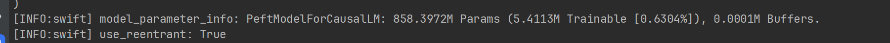
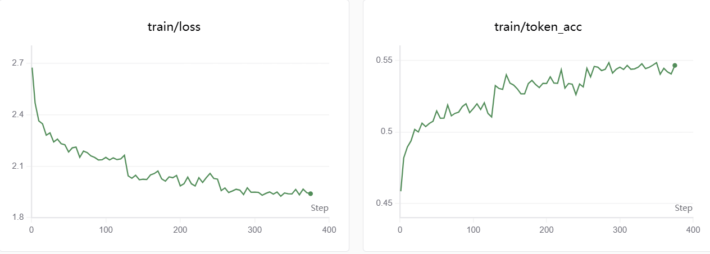
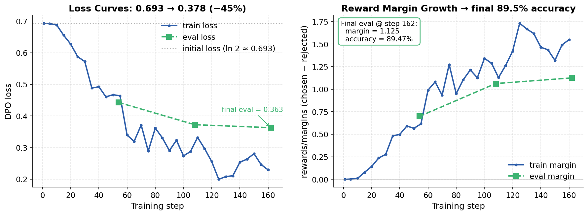
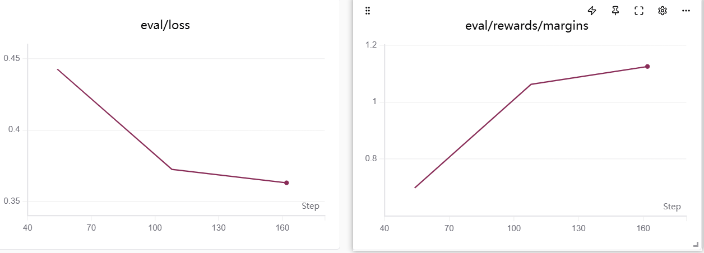

# 基于 LoRA 与 DPO 的中文心理咨询大语言模型的设计与实现

## 1. 项目概述
本项目基于 **Qwen3.5-0.8B** 基座模型，使用高质量心理咨询对话数据集 `PsyDTCorpus` 进行领域适配，设计并实现了一套完整的中文心理咨询大语言模型训练方案。首先，采用 **LoRA (Low-Rank Adaptation)** 方法进行监督微调（SFT），使模型具备基础的心理咨询领域能力；随后基于SFT模型生成多候选回复，并结合规则评分机制自动构建偏好数据对；最后利用 **DPO (Direct Preference Optimization)** 算法进行偏好对齐训练，进一步提升模型在共情表达、上下文相关性等方面的表现。

**Dataset:** [YIRONGCHEN/PsyDTCorpus](https://modelscope.cn/datasets/YIRONGCHEN/PsyDTCorpus)

**结果：**模型在 202 条未参与训练的测试样本上，相较于 SFT 基线模型取得了 **73.76% 的胜率**。评测采用 **DeepSeek V4-Flash** 作为裁判模型；同时模型生成结果几乎不存在长度偏差，平均仅增加 **1.3 个字符**。

**Pipeline Overview:**

```
微调后的 Qwen3.5-0.8B 模型
↓
从 PsyDTCorpus 预留集中采样 1232 条提示词 (prompts)
↓
针对每条提示词，使用多样化温度生成 K=4 个候选回复
↓
使用规则评分器 (7个维度) 对每个回复进行打分
↑                                         │
│                                         ↓
+------ 迭代优化 (2轮，对60组数据进行误差分析) -+
│
↓
构建 431 组偏好对 (优选 vs 淘汰) + 19 组验证对
↓
执行 DPO 训练: LoRA r=8, beta=0.1, 3个周期, 学习率 5e-6 (ms-swift)
↓
第三阶段: 200条提示词的 LLM-as-Judge 评估 (DeepSeek V4-Flash, 双向对比)
↓
最终胜率: 73.76%
```

---

## 2. LoRA 监督微调

* **Trainable parameters:**仅需训练 `0.63% `的模型参数

  

* **Final Loss**:  `1.9394`

* **Token Accuracy**: `> 54%`

* **Training Time**: `~1h 20m`



## 3. DPO训练

- **Base Model:** 基于Lora微调后的`Qwen3.5-0.8B` 
- **Framework**: `ms-swift`
- **Adapter**: LoRA `r=8, α=32`, target `qkv_proj + o_proj + mlp.{up,down,gate}`
- **Reference adapter**: 标准 DPO 设置
- **Hyperparams:** `β=0.1, lr=5e-6, 3 epochs, bf16, grad_ckpt`
- **Hardware:**`NVIDIA GeForce RTX 4090  (24GB VRAM)`
- **Trainable parameters:** 5.4M (0.63%) — GPU memory 8.52 / 24 GiB.

**训练曲线：**





| Metric                    | Final value             |
| ------------------------- | ----------------------- |
| `train_loss`              | 0.2295                  |
| `eval_loss` (epoch 3)     | **0.3629** （未过拟合） |
| `eval_rewards/accuracies` | **89.75%** (17/19)      |
| `eval_rewards/margins`    | 1.1248                  |
| Train time                | 47m 22s                 |

---

## 4.LLM-as-Judge Evaluation

---

| 选项         | 配置                                            |
| ------------ | ----------------------------------------------- |
| Sample       | 202 个（因取整导致）                            |
| Generation   | `T=0.7, top_p=0.9, rep_pen=1.05, fixed seed=42` |
| 裁判 (Judge) | DeepSeek V4-Flash                               |
| 位置偏差缓解 | 每对样本通过交换 A/B 顺序进行 两次 评判         |

**评分规则：**

- 两次均为 DPO 胜 → 1.0
- 两次均为 SFT 胜 → 0.0
- 两次均为平局 → 0.5
- 一次 DPO 胜 + 一次 SFT 胜（视为位置偏差）→ 0.5
- 一次胜出 + 一次平局 → 分别计为 0.75 或 0.25

| 结果                                         | 数量      | %          |
| -------------------------------------------- | --------- | ---------- |
| DPO 完胜                                     | **131**   | **64.9%**  |
| DPO 获胜 + 平局                              | 1         | 0.5%       |
| 两次均为平局                                 | 1         | 0.5%       |
| 位置偏差（1-1 平分）                         | 33        | 16.3%      |
| SFT 获胜 + 平局                              | 3         | 1.5%       |
| SFT 完胜                                     | 35        | 17.3%      |
| 总加权胜率                                   |           | **73.76%** |
| 纯胜率 (DPO consistent / DPO+SFT consistent) | 131 / 167 | **78.9%**  |

所有 12 个主题的 DPO 胜率均大于65%，不存在性能回退的现象；并且DPO的平均长度与SFT 平均长度仅相差1.3 个字符，这一微小差异排除了长度偏差作为获胜来源的可能性——其收益完全来自于内容质量的提升。

